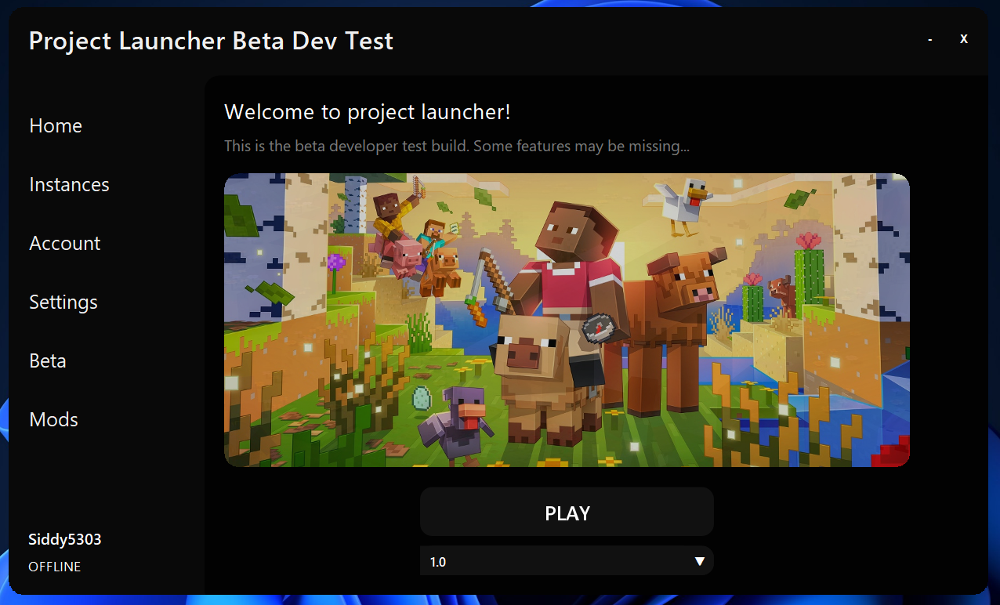

Welcome to the world of powerful tools, where one of the coolest tool could be **Project Launcher**. Project launcher is a powerful, modern, and fully-featured Minecraft launcher designed with performance, customization, and simplicity in mind. Built in Java, it supports both offline play and advanced features, giving players full control over their Minecraft experience. Whether you’re a casual player or a mod enthusiast, Project Launcher makes launching Minecraft smooth, efficient, and stress-free.

Launcher sample - In early development

- **Multi Synced Instance Management** - Manage your instances from multiple devices and install them on all your devices, with synchronized settings, accounts and data (servers)
- **Legacy Console Edition Instances** - Allows you to use a Minecraft LCE (XBOX360 or PS3, PS4 support is not ready) ROM to launch instances, remember that the ROM is required to run the game, with custom PLCE Emulator optimized for the best experience.
- **Inbuilt MOD support** - MODS installation along with MODDED CLIENT support inbuilt.
- **Synchronized Settings**: All settings are synced to your ProjectLauncher Account.
- **Bedrock Edition support**: Support for bedrock edition instance management. Beware that this requires a microsoft account with a bedrock edition purchase!
- **Optimal Seting Management Execution on each launch**: Your minecraft version's specifications and settings will be optimized with your computers specifications as soon as you launch the game, allowing you to focus on the game instead of tweaking your render distance up and down.

⚠️ Project launcher is currently under beta testing, If you want to, you can just get the build, but I am not responsible for:
 - Missing features
 - Bugs
 - Errors
 - And other promised stuff

Current build: betaV1.3.0 REVAMPED
-> Downloads under builds section
